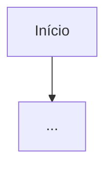

# {{ATD}} — {{TITULO}}

## Projeto

[[{{PROJETO}}]]

| Campo | Valor |
| --- | --- |
| Tipo | {{TIPO}} |
| Chamado Agidesk | {{AGIDESK}} |
| Solicitante | {{SOLICITANTE}} |
| Analista responsável | {{ANALISTA}} |
| Sistemas envolvidos | {{SISTEMAS}} |
| Status | {{STATUS}} |
| Data | {{DATA}} |

## 1. Problema

<!-- A dor, não a solução. Se a demanda já chegou como solução, registrar aqui qual problema ela resolve. -->

Não identificado

## 2. Objetivo

<!-- Resultado esperado. Como saberemos que foi resolvido. -->

Não identificado

## 3. Contexto atual

<!-- Como funciona hoje. O que o usuário já faz. Se é novo, descrever o cenário sem a funcionalidade. -->

Não identificado

## 4. Escopo

### Dentro do escopo

-

### Fora do escopo

-

## 5. Requisitos

### Funcionais

| ID | Requisito | Confirmado / Presumido |
| --- | --- | --- |
| RF-01 | | |

### Não-funcionais

| ID | Requisito | Tipo (performance / segurança / volumetria) |
| --- | --- | --- |
| RNF-01 | | |

## 6. Regras de negócio

| ID | Regra | Condição | Origem (confirmada / a validar) |
| --- | --- | --- | --- |
| RN-01 | | | |

## 7. Casos de uso

### CU-01 — [nome]

- **Requisito relacionado:** RF-01
- **Ator:**
- **Pré-condição:**
- **Fluxo principal:**
  1.
  2.
- **Fluxo alternativo:**
- **Pós-condição:**

<!-- Repetir o bloco por caso de uso. Todo requisito precisa de pelo menos um caso de uso; todo caso de uso precisa referenciar um requisito. -->

## 8. Critérios de aceite

| ID | Caso de uso | Critério (dado / quando / então) |
| --- | --- | --- |
| CA-01 | CU-01 | |

## 9. Casos de borda e exceções

| Cenário | Comportamento esperado |
| --- | --- |
| Cancelamento no meio do processo | |
| Dado vazio / duplicado / inválido | |
| Sistema externo indisponível | |
| Dados retroativos | |
| Concorrência (dois usuários, mesma operação) | |
| Rollback / desfazer | |

## 10. Sistemas e integrações técnicas

<!-- Só o que ESTA demanda toca. O inventário do sistema fica no projeto.md. -->

| Sistema | Objeto (tabela / function module / classe / transação) | Acesso | Validado via sap-adt |
| --- | --- | --- | --- |
| | | leitura / escrita | sim / não / n-a |

## 11. Fluxo

## 12. Protótipo / telas

<!-- Link ou referência ao artifact gerado em construcao-telas, se houver. -->

## 13. Dependências e riscos

| Item | Tipo (dependência / risco) | Impacto se não resolvido |
| --- | --- | --- |
| | | |

## 14. Dúvidas e gaps em aberto

-

## 15. Histórico de revisão

| Data | Versão | Autor | Mudança |
| --- | --- | --- | --- |
| {{DATA}} | 0.1 | {{ANALISTA}} | Criação da demanda |

## Decisões

<!-- Decisões tomadas durante esta demanda ficam aqui, não em notas separadas. -->

-

## Relacionados

<!-- Conhecimento, empresas e demandas relacionadas, com [[link]]. -->

-
